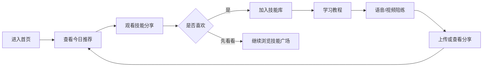
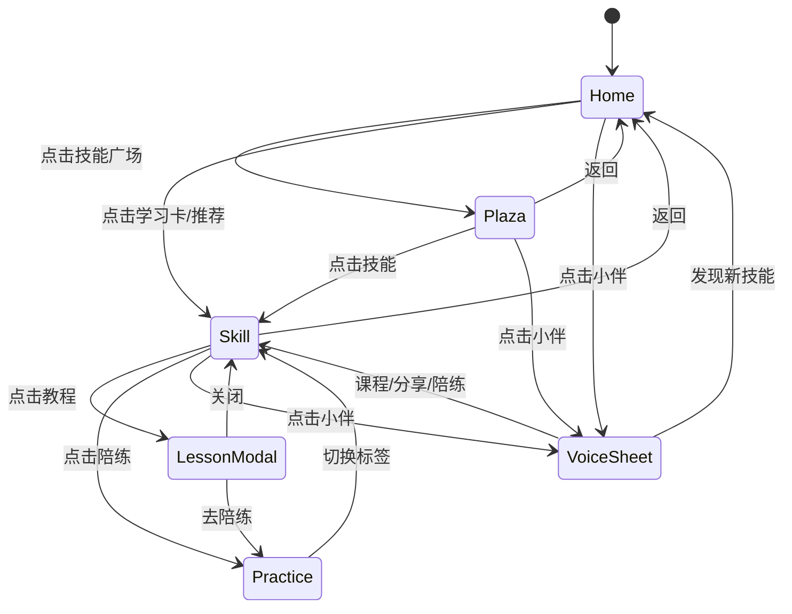

# 小伴 · 银发 AI 私教

## 产品需求文档（PRD）

| 项目 | 内容 |
| --- | --- |
| 文档版本 | V1.0 |
| 文档状态 | 原型评审稿 |
| 创建日期 | 2026-09-09 |
| 产品形态 | 面向中老年用户的 Web App 原型 |
| 当前入口 | `index.html` -> `src/main.jsx` |
| 需求来源 | 现有交互原型与源代码；未接入用户调研和线上数据 |

> 本文档以当前原型为唯一事实来源。所有用户规模、留存、准确率和商业指标均未经过线上验证，标记为“待验证”的内容不得视为已实现能力。

## 1. 产品概述

### 1.1 产品定位

“小伴”是一款面向中老年用户的兴趣学习陪伴型产品。它通过低压力的内容发现、短教程、社区分享和陪练入口，帮助用户从“想学一个兴趣”开始，形成可持续的学习习惯。

当前原型覆盖书法、摄影、乐器、家庭园艺四类技能，验证的核心闭环是：

### 1.2 用户问题

- 不知道从哪个兴趣开始，兴趣内容与学习入口分散。
- 长者需要更慢、更明确、更有陪伴感的学习节奏。
- 只看教程容易中断，缺少“接着练”和低门槛反馈。
- 用户希望看到同龄人的真实练习成果，而不是只面对标准化课程。

### 1.3 产品目标

**用户目标**

1. 在 1 分钟内找到一个感兴趣的技能或内容。
2. 能从上次进度继续学习，并明确下一步动作。
3. 用语音或视频陪练完成一次约 10 分钟的练习。
4. 看到他人分享并发布自己的练习成果。

**产品验证目标**

1. 验证“推荐内容 -> 加入学习 -> 陪练”的主流程是否易懂。
2. 验证悬浮助手是否能降低导航和操作成本。
3. 验证本地优先的原型状态是否足以支撑首次体验。

## 2. 目标用户与使用场景

### 2.1 目标用户画像

| 用户 | 特征 | 主要诉求 | 设计约束 |
| --- | --- | --- | --- |
| 退休或半退休长者 | 有稳定空闲时间，想培养兴趣 | 找到喜欢的活动并坚持 | 文字要清晰，操作步骤少，反馈明确 |
| 中年兴趣学习者 | 工作之余学习书法、摄影、乐器等 | 短时练习、持续进步 | 支持断点续学，减少重复查找 |
| 家庭陪伴者 | 帮父母或长辈选择内容 | 快速理解产品并协助上手 | 流程可解释，隐私提示清楚 |

### 2.2 关键场景

**场景 A：首次发现兴趣**

- 用户进入首页，看到“今日推荐”。
- 点击推荐视频，浏览推荐视频内容。
- 视频结束后出现“加入学习”询问。
- 用户确认后，该技能进入首页“正在学习”。

**场景 B：继续上次课程**

- 用户从首页打开已加入的书法技能。
- 在“教程”页看到上次观看位置和剩余时长。
- 打开课程弹窗，播放后进入陪练。

**场景 C：完成一次陪练**

- 用户进入“陪练”页，选择语音或视频模式。
- 点击开始后，看到当前练习状态和步骤提示。
- 完成一轮 10 分钟练习。

**场景 D：分享练习成果**

- 用户打开“分享”页查看他人内容。
- 点赞或收藏内容，或选择上传视频。
- 上传内容仅在当前页面展示，用于验证分享流程。

## 3. 产品范围

### 3.1 MVP 范围

| 模块 | MVP 内容 | 优先级 |
| --- | --- | --- |
| 首页 | 今日推荐、正在学习技能卡、进入技能广场 | P0 |
| 技能广场 | 全部/正在学习/未加入筛选，技能详情入口 | P0 |
| 技能课堂 | 教程列表、课程弹窗、断点续学展示 | P0 |
| 陪练 | 语音/视频模式切换、开始/结束、步骤反馈 | P0 |
| 分享 | 示例内容、点赞、收藏、上传入口 | P1 |
| 小伴助手 | 悬浮、拖动、快捷入口、加入提示 | P1 |
| 本地状态 | 技能库和助手位置持久化 | P1 |

### 3.2 非 MVP 范围

- 真实语音识别、语音对话和动作识别模型。
- 账号体系、云端同步、社交关系和内容审核后台。
- 真实视频上传、转码、存储和 CDN 分发。
- 课程生产后台、教师端、付费订阅和支付。
- 保险规划方向的 `conversation.jsx`、`insurance.jsx`，它们是仓库中的备用探索稿，不属于本产品主流程。

## 4. 功能需求

### 4.1 首页与学习库

**功能说明**

- 展示问候语、品牌信息和今日推荐。
- 展示正在学习的技能数量和技能卡片。
- 技能卡片显示技能名称、标语、学习天数和背景图。
- 点击技能卡进入该技能教程页。
- 点击加号或空状态进入技能广场。
- 支持从技能卡执行“不感兴趣”和“完成学习”。

**验收标准**

- 默认首次访问时至少展示书法技能。
- 技能加入或移除后，首页数量和卡片立即更新。
- 刷新页面后，已加入技能和加入日期仍可恢复。
- 没有学习技能时，展示明确的空状态入口。

### 4.2 技能广场

**功能说明**

- 展示书法、摄影、乐器、家庭园艺四类技能。
- 支持“全部”“正在学习”“未加入”三种筛选。
- 已加入技能和未加入技能进行分组排序。
- 点击技能进入内容浏览页；从推荐内容进入时标记为“今日推荐”。

**验收标准**

- 筛选结果只包含符合当前筛选条件的技能。
- 点击任意技能后可以返回广场，不丢失当前已保存的技能库。
- 推荐技能未加入时，浏览结束后可以触发加入提示。

### 4.3 教程与课程播放

**功能说明**

- 技能页默认进入“教程”标签。
- 展示“接着练”卡片、上次观看时间、进度条和剩余时间。
- 展示 3 节教程，每节包含标题、等级、时长和封面。
- 点击教程打开播放弹窗。
- 弹窗支持播放/暂停、关闭和进入陪练。

**验收标准**

- 教程列表可点击，弹窗展示对应课程信息。
- 点击“看完了，去陪练”后关闭弹窗并切换到陪练标签。
- 播放状态在当前页面内可切换，不影响其他页面导航。

### 4.4 分享内容

**功能说明**

- 技能页支持“分享”标签。
- 展示推荐视频或社区练习内容，包括作者、文案、时间和点赞数。
- 支持点赞和收藏状态切换，并即时更新显示。
- 支持上传本地视频并在当前技能的列表顶部显示预览。
- 支持交流按钮作为后续社交功能入口。

**验收标准**

- 点赞后图标状态和数量变化，再次点击可恢复。
- 收藏后文案在“收藏”和“已收藏”之间切换。
- 选择视频文件后，页面不刷新且能看到新内容。
- 关闭或刷新页面后，上传内容不保证保留，需在产品说明中明确。

### 4.5 语音/视频陪练

**功能说明**

- 提供“视频陪练”和“语音陪练”两个模式。
- 未开始时展示准备状态、预计时长和开始按钮。
- 开始后展示在线状态、当前练习步骤和控制按钮。
- 视频模式显示摄像头使用提示；语音模式显示聆听状态和声波反馈。
- 支持结束练习和切换下一步。

**验收标准**

- 模式切换后，标题、图标和交互文案同步变化。
- 点击开始后进入进行中状态，再次点击结束可回到未开始状态。
- 点击下一动作后，步骤提示按预设顺序轮换。
- 原型不得将演示状态描述为真实 AI 分析结果。

### 4.6 小伴悬浮助手

**功能说明**

- 悬浮助手始终位于内容上层，并限制在可视区域内。
- 点击打开语音快捷面板，提供继续课程、查看分享、开始陪练、发现新技能四个入口。
- 拖动助手可改变位置；位置保存到浏览器本地。
- 推荐技能浏览结束后，展示“加入学习/先看看”确认气泡。

**验收标准**

- 点击和拖动行为可区分，短点击不会被误判为拖动。
- 浏览器窗口尺寸变化后，助手不会移出可视区域。
- 刷新页面后，助手位置能够恢复或回退到合法默认位置。
- 快捷入口能导航到对应标签或页面。

### 4.7 隐私与本地状态

**功能说明**

- 首次体验提示不要填写身份证、电话、病历或银行卡信息。
- 技能库和加入日期保存到 `localStorage`。
- 上传视频使用浏览器临时对象 URL。
- 页面提供隐私说明弹窗，强调原型数据不自动上传。

**验收标准**

- 本地存储损坏时，应用能够清理异常数据并恢复默认状态。
- 隐私说明可打开、关闭，不阻塞主要导航。
- 任何真实上线版本必须在接入云端服务前重新完成隐私、权限和内容合规评审。

## 5. 交互与状态设计

### 5.1 页面状态

### 5.2 核心状态

| 状态 | 存储位置 | 说明 |
| --- | --- | --- |
| 当前视图 | React state | `home`、`plaza`、`skill` |
| 当前技能和标签 | React state | 技能 key 与 `tutorial/feed/practice` |
| 技能库、加入日期 | `localStorage` | key：`silver-coach-learning-state` |
| 小伴位置 | `localStorage` | key：`silver-coach-position` |
| 点赞、收藏 | React state | 当前会话有效 |
| 上传内容 | React state | 当前页面生命周期有效 |
| 播放、弹窗和 Toast | React state | 短期交互反馈 |

## 6. 非功能需求

### 6.1 可用性

- 主要操作应使用图标与文字组合，避免仅依赖颜色传达状态。
- 移动端优先，适配窄屏和触摸操作。
- 主要页面在无障碍树中提供按钮名称和状态信息。
- 用户完成一次核心流程的目标时长待通过可用性测试确定。

### 6.2 性能

- 首屏不应加载 `node_modules` 或构建目录中的开发文件。
- 生产构建需保持资源体积可控；单文件版本仅用于演示，不作为线上部署形态。
- 真实版本接入视频和模型服务后，需要补充首屏、视频首帧、接口响应和错误率指标。

### 6.3 隐私与安全

- 原型不要求用户输入敏感身份、健康或金融信息。
- 真实上传、语音和摄像头能力必须经过明确授权，并提供关闭和删除路径。
- 真实版本需要增加账号、数据保留期限、删除机制、内容审核和第三方资源许可说明。

## 7. 数据与埋点建议

当前原型没有埋点服务。上线前建议至少记录以下事件，具体指标阈值待验证：

| 事件 | 关键属性 | 目的 |
| --- | --- | --- |
| `home_view` | 是否首次访问 | 衡量入口触达 |
| `featured_open` | 技能、来源 | 衡量推荐点击 |
| `skill_join` | 技能、来源页面 | 衡量兴趣转化 |
| `lesson_open` | 技能、课程、等级 | 衡量学习内容消费 |
| `practice_start` | 技能、模式 | 衡量陪练启动 |
| `practice_complete` | 技能、模式、时长 | 衡量练习完成 |
| `feed_like` / `feed_save` | 技能、内容 | 衡量内容互动 |
| `upload_submit` | 技能、文件类型 | 衡量分享意愿 |
| `mascot_shortcut` | 入口、目标页面 | 衡量助手价值 |

## 8. 版本计划

### V1.0 原型验证（当前）

- 完成首页、技能广场、教程、分享、陪练和小伴助手的交互演示。
- 使用本地状态保证刷新后的基础连续性。
- 提供单文件构建，支持面试或评审现场演示。

### V1.1 可用性验证（待规划）

- 招募中老年用户完成任务测试。
- 验证字体、对比度、点击区域和文案理解度。
- 修复主流程阻塞点，补充错误态、加载态和空态。

### V2.0 服务化（待评估）

- 账号与云端学习进度。
- 真实课程播放、上传和内容审核。
- 语音识别、对话式陪练和动作反馈。
- 隐私、权限、内容版权和合规方案。

## 9. 风险与待验证问题

| 风险/问题 | 影响 | 验证方式 |
| --- | --- | --- |
| 长者是否理解“技能广场”和标签含义 | 影响发现和导航 | 任务可用性测试 |
| 悬浮助手是否造成遮挡或误触 | 影响阅读和操作 | 移动端观察与点击热区测试 |
| 用户是否愿意上传练习视频 | 影响社区闭环 | 访谈、原型测试 |
| 10 分钟陪练是否合适 | 影响完成率 | 不同年龄段 A/B 测试 |
| 远程图片/视频资源许可是否适合上线 | 产生版权风险 | 逐项确认许可并替换生产资源 |
| “AI 陪练”是否被误解为专业指导 | 产生信任与合规风险 | 文案评审、用户访谈 |
| 本地存储能否满足跨设备连续学习 | 影响留存 | 服务化方案评估 |

## 10. 原型与生产版本差异

当前实现是前端交互原型，以下内容不能作为已交付能力对外承诺：

- 陪练页面中的摄像头和麦克风仅展示交互状态，不会真正采集或分析数据。
- 点赞、收藏、上传和进度没有服务端持久化。
- 社区交流按钮没有后续页面或消息系统。
- 课程内容、图片和示例视频使用演示资源，生产环境需替换为有授权的内容。
- `src/conversation.jsx` 与 `src/insurance.jsx` 为备用保险规划探索稿，未接入当前默认入口。

## 11. 需求追踪来源

| 需求模块 | 主要实现文件 |
| --- | --- |
| 首页、技能广场、技能页、助手 | `src/main.jsx` |
| 主应用视觉与响应式样式 | `src/styles.css` |
| 便携单文件构建 | `scripts/build-portable.mjs` |
| Vite 入口与页面元信息 | `index.html` |

